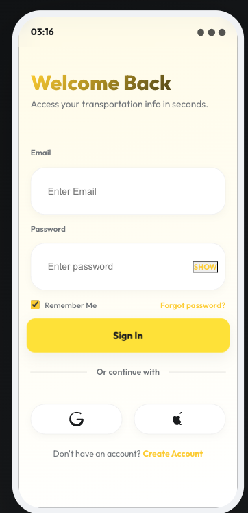
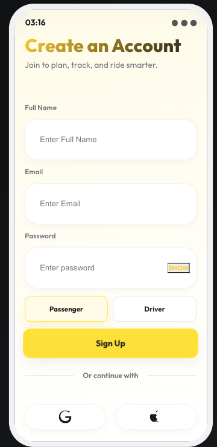
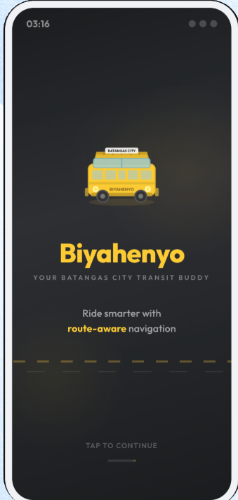
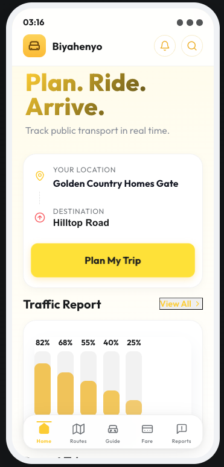
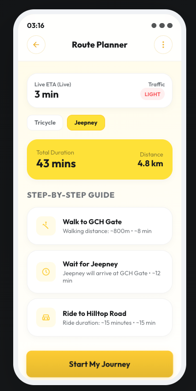
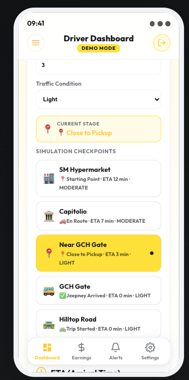
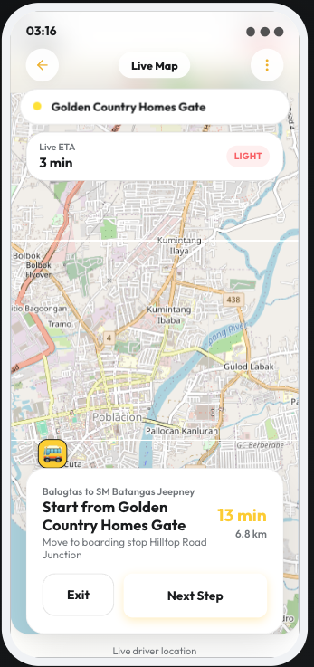
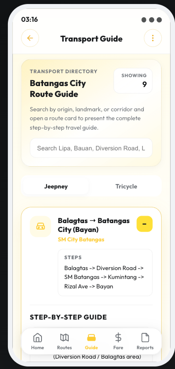
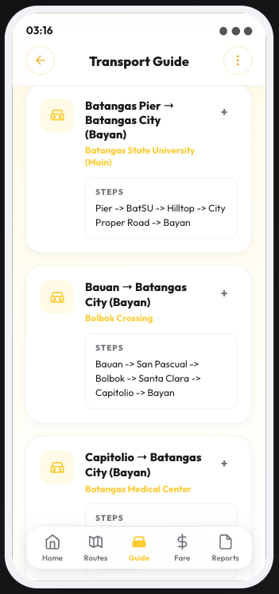

<div align="center">

# 🚌 Biyahenyo

**A real-time public transportation tracking and route planning application for Batangas City, Philippines.**


</div>

---

## 📋 Table of Contents

- [Problem Statement](#-problem-statement)
- [Solution](#-solution)
- [Screenshots](#-screenshots)
- [Features](#-features)
- [Architecture](#-architecture)
- [Tech Stack](#-tech-stack)
- [Installation](#-installation)
- [API Overview](#-api-overview)
- [Folder Structure](#-folder-structure)
- [Security](#-security)
- [Challenges](#-challenges)
- [Future Improvements](#-future-improvements)
- [Author](#-author)

---

## 🎯 Problem Statement

Public transportation in Batangas City, Philippines — primarily jeepneys and tricycles — operates without real-time tracking, centralized route information, or fare transparency. Commuters face:

- **No visibility** into vehicle locations or arrival times
- **Uncertain fares** with no standardized fare matrix
- **Limited route knowledge**, especially for unfamiliar areas
- **No way to plan trips** across multiple transport modes
- **Drivers lack tools** to broadcast their location to passengers

This results in long wait times, inefficient route choices, and a frustrating daily commute for thousands of residents and students.

---

## 💡 Solution

**Biyahenyo** is a full-stack web application that digitizes the Batangas City public transit experience. It provides:

- **Real-time vehicle tracking** via GPS broadcasting from driver devices
- **Intelligent route planning** using OSRM road-network routing and Nominatim geocoding
- **Dynamic fare estimation** based on distance and passenger type (regular, student, senior)
- **Live traffic prediction** with location-aware congestion data
- **A driver dashboard** for broadcasting location, ETA, and traffic conditions

The application is designed mobile-first, providing a native app-like experience directly from the browser.

---

## 📸 Screenshots

### Authentication & Home
| Login | Sign Up | Home Dashboard |
|:-----:|:-------:|:--------------:|
|  |  |  |

### Route Planning
| Search | Route Options | Trip Tracking | Live Map |
|:------:|:-------------:|:-------------:|:--------:|
|  |  |  |  |

### Fare Calculator & Transport Guide
| Fare Input | Fare Result | Guide | Route Details |
|:----------:|:-----------:|:-----:|:-------------:|
|  |  |  |  |

---

## ✨ Features

### Passenger Features
- **Route Planner** — Enter origin and destination to get optimized transit routes with walking directions, boarding stops, and step-by-step segments
- **Live Map** — Track your assigned vehicle in real-time on an interactive Leaflet map with route polyline visualization
- **Fare Estimator** — Calculate estimated fares based on vehicle type, distance, and passenger category (regular/student/senior)
- **Transport Guide** — Browse all jeepney and tricycle routes with stops, landmarks, and color-coded line identifiers
- **Traffic Dashboard** — View weekly traffic congestion patterns across key Batangas City corridors
- **Recent Trips** — Quick access to previously planned routes for repeat commutes

### Driver Features
- **Driver Dashboard** — View assigned route, current location, ETA to destination, and traffic conditions
- **GPS Broadcasting** — Share real-time location with passengers via browser Geolocation API or simulation mode
- **Demo Mode** — Simulate driving through route checkpoints for presentations and testing
- **Traffic Reporting** — Update traffic conditions (Light/Moderate/Heavy) at current location

### Platform Features
- **JWT Authentication** — Secure token-based auth with role-based access control (Passenger/Driver)
- **Responsive Design** — Mobile-first layout that adapts to all screen sizes
- **Accessible UI** — Focus-visible styles, ARIA labels, reduced-motion support, screen-reader friendly

---

## 🏗️ Architecture

```
┌─────────────────────────────────┐
│        React Frontend           │
│   (Vite + React 19 + Leaflet)  │
│        Port 5173                │
└──────────────┬──────────────────┘
               │ REST API (JSON)
               ▼
┌─────────────────────────────────┐
│      Spring Boot Backend        │
│  (Java 17 + Spring Security)   │
│        Port 8080                │
├─────────────────────────────────┤
│  Controllers → Services → Repos │
│  JWT Filter → Security Config   │
└──────┬────────────┬─────────────┘
       │            │
       ▼            ▼
┌────────────┐ ┌─────────────────┐
│   MySQL    │ │  External APIs  │
│ (Railway)  │ │  • Nominatim    │
│            │ │  • OSRM         │
└────────────┘ └─────────────────┘
```

### Design Principles
- **Layered Architecture** — Controllers handle HTTP, Services contain business logic, Repositories manage data access
- **DTO Pattern** — Request/response objects decouple the API from internal entities
- **Service Extraction** — Geocoding, routing, and transport logic separated into focused services
- **Stateless Auth** — JWT tokens with role-based endpoint protection via Spring Security

---

## 🛠️ Tech Stack

### Frontend
| Technology | Purpose |
|------------|---------|
| React 19 | UI framework with hooks and context |
| Vite 7 | Build tool with code-splitting |
| React Router 7 | Client-side routing with role-based guards |
| Leaflet + React-Leaflet | Interactive maps with OpenStreetMap tiles |
| CSS Variables | Consistent theming and design tokens |

### Backend
| Technology | Purpose |
|------------|---------|
| Java 17 | Runtime environment |
| Spring Boot 3.4 | Web framework, dependency injection, auto-configuration |
| Spring Security | JWT authentication, role-based authorization |
| Spring Data JPA | Database access with Hibernate |
| Flyway | Database schema migration management |
| H2 / MySQL | Development / production database |
| jjwt 0.12 | JWT token generation and validation |

### External Services
| Service | Purpose |
|---------|---------|
| Nominatim (OSM) | Geocoding addresses to coordinates |
| OSRM | Road-network routing and distance/duration calculation |
| Vercel | Frontend hosting and CDN |
| Railway | Backend hosting and MySQL database |

---

## 🚀 Installation

### Prerequisites
- Java 17+
- Node.js 18+
- npm or yarn

### Backend Setup

```bash
cd biyahenyo_backend

# Build the project
./gradlew build

# Run the application
./gradlew bootRun
```

The backend starts at `http://localhost:8080`. Seed data (routes, stops, vehicles) is automatically loaded on first run.

### Frontend Setup

```bash
cd biyahenyo_frontend

# Install dependencies
npm install

# Start development server
npm run dev
```

The frontend starts at `http://localhost:5173`.

### Default Accounts

| Role | Email | Password |
|------|-------|----------|
| Passenger | `user@gmail.com` | `user` |
| Driver | `driver@gmail.com` | `driver` |

---

## 🌐 Deployment

### Frontend (Vercel)

```bash
# Install Vercel CLI
npm install -g vercel

# Deploy
vercel --prod
```

Set environment variables in the Vercel dashboard:
- `VITE_API_BASE_URL` — Your deployed backend URL

### Backend (Railway)

```bash
# Install Railway CLI
npm install -g @railway/cli

# Login and create project
railway login
railway init --name biyahenyo-backend

# Add MySQL database
railway add --database mysql

# Set environment variables
railway variables --set "JWT_SECRET=<your-secret>" --set "SPRING_PROFILES_ACTIVE=prod"

# Deploy
git push origin main  # Auto-deploys from GitHub
```

Required environment variables:
| Variable | Description |
|----------|-------------|
| `JWT_SECRET` | Secret key for JWT signing (min 32 chars) |
| `SPRING_PROFILES_ACTIVE` | Set to `prod` |
| `DB_URL` | MySQL connection URL |
| `DB_USERNAME` | MySQL username |
| `DB_PASSWORD` | MySQL password |
| `CORS_ORIGINS` | Comma-separated allowed frontend origins |

---

## 📡 API Overview

All endpoints are prefixed with `/api`. Authentication uses `Bearer` token in the `Authorization` header.

### Authentication
| Method | Endpoint | Auth | Description |
|--------|----------|------|-------------|
| POST | `/api/auth/register` | Public | Create new account |
| POST | `/api/auth/login` | Public | Login and receive JWT |
| GET | `/api/auth/me` | Required | Get current user profile |

### Route Planning
| Method | Endpoint | Auth | Description |
|--------|----------|------|-------------|
| GET | `/api/routes/plan` | Required | Plan a route (mode, from, to) |
| POST | `/api/routes/trips/start` | Required | Start a tracked trip |
| GET | `/api/routes/trips/{tripId}` | Required | Get trip status |
| POST | `/api/routes/trips/{tripId}/advance` | Required | Advance to next trip step |
| GET | `/api/routes/suggest` | Required | Get route suggestions |
| GET | `/api/routes/cheapest` | Required | Find cheapest route |

### Driver
| Method | Endpoint | Auth | Description |
|--------|----------|------|-------------|
| GET | `/api/driver/dashboard` | DRIVER | Get driver dashboard |
| POST | `/api/driver/update-location` | DRIVER | Broadcast GPS location |
| GET | `/api/driver/location/{driverId}` | Required | Get driver's live location |

### Other
| Method | Endpoint | Auth | Description |
|--------|----------|------|-------------|
| GET | `/api/home/dashboard` | Required | Get passenger home data |
| GET | `/api/fare/estimate` | Required | Calculate fare |
| GET | `/api/traffic/predict` | Required | Predict traffic level |
| POST | `/api/reports/add` | Required | Submit a report |
| GET | `/api/reports/all` | Required | Get all reports |

---

## 📁 Folder Structure

```
biyahenyo-main/
├── biyahenyo_backend/
│   └── src/main/java/biyahenyo/biyahenyo_backend/
│       ├── config/              # Security, CORS, data initialization
│       ├── controller/          # REST API endpoints
│       ├── dto/                 # Request/response data transfer objects
│       ├── model/               # JPA entities and enums
│       ├── repository/          # Spring Data JPA repositories
│       ├── security/            # JWT utility and filter
│       ├── service/             # Business logic
│       │   ├── GeocodingService   # Place resolution (Nominatim)
│       │   ├── RoutingService     # Road routing (OSRM)
│       │   ├── TransportService   # Core transit logic
│       │   └── ...
│       └── util/                # Shared utilities (GeoUtil)
│
├── biyahenyo_frontend/
│   └── src/
│       ├── api/                 # HTTP client and API modules
│       ├── auth/                # Authentication context
│       ├── components/          # Reusable UI components
│       │   ├── LoadingSpinner.jsx
│       │   ├── ErrorState.jsx
│       │   ├── EmptyState.jsx
│       │   ├── BottomNav.jsx
│       │   └── PassengerMap.jsx
│       ├── pages/               # Page-level components
│       ├── demo/                # Demo mode simulation data
│       └── services/            # Business-level API services
│
├── screenshots/                 # Application screenshots
├── vercel.json                  # Vercel deployment config
└── nixpacks.toml               # Railway build config
```

---

## 🔒 Security

- **JWT Authentication** — Stateless token-based auth with 7-day expiry
- **Role-Based Access Control** — Passengers and drivers have distinct permission scopes
- **Input Validation** — Jakarta Validation on all request DTOs with size and format constraints
- **Mass Assignment Protection** — DTOs prevent overwriting of server-managed fields (e.g., IDs)
- **Privilege Escalation Prevention** — User role is server-enforced, not client-selectable
- **CORS Configuration** — Configurable allowed origins via environment variable
- **Error Handling** — Centralized exception handler prevents internal details from leaking
- **Schema Migrations** — Flyway ensures consistent database schema across environments

---

## 🧩 Challenges

### 1. Real-Time Location Without WebSockets
**Challenge:** Tracking driver locations in real-time without WebSocket infrastructure.  
**Solution:** Implemented efficient polling (every 4 seconds) with `ConcurrentHashMap` for driver locations. The frontend uses `setInterval` with cleanup on unmount to prevent memory leaks. The driver's browser Geolocation API broadcasts GPS coordinates, with a simulation fallback for demo mode.

### 2. Multi-Modal Route Optimization
**Challenge:** Finding the best boarding/alighting stops across multiple transit routes.  
**Solution:** Developed a scoring algorithm that evaluates every valid (boarding, alighting) pair across all active routes. The score weighs walking distance to boarding stop, walking distance from alighting stop, and transit distance — selecting the combination that minimizes total travel effort.

### 3. External API Integration
**Challenge:** Integrating Nominatim (geocoding) and OSRM (routing) with proper error handling, rate limiting, and fallback behavior.  
**Solution:** Extracted `GeocodingService` and `RoutingService` as dedicated services with structured error responses. Place resolution first checks local transit stops before falling back to external geocoding, reducing API calls for common locations.

### 4. Dual-Role Authentication
**Challenge:** A single JWT token needs to serve both passenger and driver interfaces with different permissions.  
**Solution:** JWT claims include the user role. Spring Security's filter chain maps `ROLE_USER` and `ROLE_DRIVER` to endpoint access rules. The frontend uses `ProtectedRoute` components with `allowedRoles` to guard route access.

### 5. Production Readiness
**Challenge:** Preparing a development prototype for production deployment.  
**Solution:** Implemented Flyway migrations, environment-variable-based configuration, production Spring profiles, and removed all debug artifacts. Frontend optimized with Vite code-splitting (vendor, maps, app chunks).

---

## 🔮 Future Improvements

| Priority | Feature | Description |
|----------|---------|-------------|
| High | **WebSocket Real-Time Tracking** | Replace polling with WebSocket/SSE for instant location updates |
| High | **Token Refresh Flow** | Implement refresh tokens with revocation for improved security |
| High | **Rate Limiting** | Add API rate limiting to prevent abuse |
| Medium | **Push Notifications** | Notify passengers when their vehicle is approaching |
| Medium | **Email Verification** | Verify user emails on registration |
| Medium | **Forgot Password** | Password recovery flow via email |
| Medium | **Pagination** | Add pagination for reports and route listings |
| Medium | **Offline Support** | Service worker for basic offline functionality |
| Low | **Driver Earnings Dashboard** | Track and visualize driver income |
| Low | **Multi-Language Support** | Filipino/Tagalog language option |
| Low | **Admin Dashboard** | Web interface for managing routes, vehicles, and drivers |

---

## 👤 Author

**Aye Nyein San**

- GitHub: [@AyeNyeinSan22](https://github.com/AyeNyeinSan22)
- Email: ayenyeinsan284@gmail.com

---

<div align="center">

**Built with ❤️ for Batangas City commuters**

</div>
